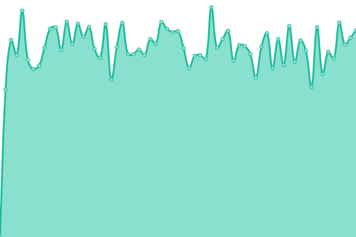

# [📈 Live Status](https://irsadarief.github.io/uptime): <!--live status--> **🟧 Partial outage**

This repository contains the open-source uptime monitor and status page for [Irsad Arief](https://irsadarief.github.io/uptime), powered by [Upptime](https://github.com/upptime/upptime).

With [Upptime](https://upptime.js.org), you can get your own unlimited and free uptime monitor and status page, powered entirely by a GitHub repository. We use [Issues](https://github.com/irsadarief/uptime/issues) as incident reports, [Actions](https://github.com/irsadarief/uptime/actions) as uptime monitors, and [Pages](https://irsadarief.github.io/uptime) for the status page.

<!--start: status pages-->
<!-- This summary is generated by Upptime (https://github.com/upptime/upptime) -->
<!-- Do not edit this manually, your changes will be overwritten -->
<!-- prettier-ignore -->
| URL | Status | History | Response Time | Uptime |
| --- | ------ | ------- | ------------- | ------ |
|  [Web Pusat](https://www.bps.go.id) | 🟥 Down | [web-pusat.yml](https://github.com/irsadarief/uptime/commits/HEAD/history/web-pusat.yml) | 

 504ms
     
 | 

<a href="https://irsadarief.github.io/uptime/history/web-pusat">0.00%</a>
    

|  [Web Prov](https://jatim.bps.go.id) | 🟥 Down | [web-prov.yml](https://github.com/irsadarief/uptime/commits/HEAD/history/web-prov.yml) | 

 503ms
     
 | 

<a href="https://irsadarief.github.io/uptime/history/web-prov">0.00%</a>
    

|  [Web Kabupaten/Kota](https://jemberkab.bps.go.id) | 🟥 Down | [web-kabupaten-kota.yml](https://github.com/irsadarief/uptime/commits/HEAD/history/web-kabupaten-kota.yml) | 

 521ms
     
 | 

<a href="https://irsadarief.github.io/uptime/history/web-kabupaten-kota">0.00%</a>
    

|  [SSO](https://sso.bps.go.id) | 🟩 Up | [sso.yml](https://github.com/irsadarief/uptime/commits/HEAD/history/sso.yml) | 

 1473ms
     
 | 

<a href="https://irsadarief.github.io/uptime/history/sso">100.00%</a>
    

|  [Drive](https://drive.bps.go.id) | 🟩 Up | [drive.yml](https://github.com/irsadarief/uptime/commits/HEAD/history/drive.yml) | 

 2498ms
     
 | 

<a href="https://irsadarief.github.io/uptime/history/drive">100.00%</a>
    

|  [ISP1](203.123.60.248) | 🟩 Up | [isp-1.yml](https://github.com/irsadarief/uptime/commits/HEAD/history/isp-1.yml) | 

 217ms
     
 | 

<a href="https://irsadarief.github.io/uptime/history/isp-1">100.00%</a>
    

|  [ISP2](203.123.61.248) | 🟩 Up | [isp-2.yml](https://github.com/irsadarief/uptime/commits/HEAD/history/isp-2.yml) | 

 227ms
     
 | 

<a href="https://irsadarief.github.io/uptime/history/isp-2">100.00%</a>
    

<!--end: status pages-->

[**Visit our status website →**](https://irsadarief.github.io/uptime)

## 📄 License

- Powered by: [Upptime](https://github.com/upptime/upptime)
- Code: [MIT](./LICENSE) © [Anand Chowdhary](https://anandchowdhary.com), supported by [Pabio](https://pabio.com)
- Data in the `./history` directory: [Open Database License](https://opendatacommons.org/licenses/odbl/1-0/)
